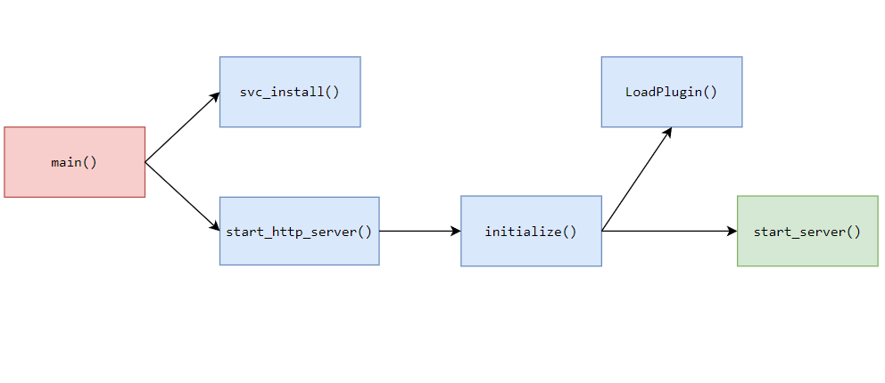

## Introduction

Ce challenge est issu du DGHACK 2023, organisé par la DGA.

`My Virtual Book Store` est un challenge d'exploitation de binaire sur Windows. Le but est d'exploiter un service hébergé sur une machine Windows accessible avec un VPN, et d'en prendre le contrôle. 

Les ressources mises à disposition sont :

- `mvb_backend.exe` et des DLL
- Une version portable de Nginx et sa configuration
- Le fichier `my_virtual_bookstore.bat`

## Premiers pas

Dans un premier temps, le script `my_virtual_bookstore.bat` lance deux choses : 

- `nginx.exe` servant sur le port `TCP/80`
- `mvb_backend.exe` servant sur le port `TCP/8888`

Le service Web est ainsi disponible en `http://127.0.0.1/` :


Cette application Web est une bibliothèque virtuelle. Elle permet de rechercher des documents et de les télécharger. On peut également y compléter son profile :


En examinant de plus près la configuration de Nginx, on repère une directive qui redirige les requêtes de la route `/api/` vers notre backend écoutant sur le port `TCP/8888`, correspondant au service `mvb_backend.exe` :

```nginx
# Route to mvb_backend.exe
location /api/ {
        proxy_pass   http://127.0.0.1:8888/;
}
```

## Reverse de l'API

### Initialisation

Lors de l'ouverture du binaire avec  `IDA`, on remarque que les symboles sont encore présents, ce qui va grandement nous simplifier la vie.

Voici un schéma d'appel des fonctions concernant l'initialisation du serveur web :  



Quelques détails notables à retenir :

####  `LoadPlugin()` 

Cette fonction est assez étrange à première vue, car elle elle permet de charger en mémoire une DLL depuis un partage SMB distant : 

```c
LoadPlugin(1, 512, 16, 777, "\\\\10.8.0.50\\bookstore_plugins\\pdf_plugin.dll");
```

En regardant le décompilé, on peut y apercevoir un appel à `LoadLibraryA` : 

```c
if ( loga )
    printf_1("Loading library at path %s\n", load_path);
  hModule = LoadLibraryA(load_path);
```

Cependant, en étudiant le code, aucunes références ne sont présentes sur son utilisation et sur ses fonctions. Elle est complétement inutile sauf pour la partie exploitation que nous verrons plus bas.

#### `start_server()`

Cette fonction lance le daemon `MHD` (Micro HTTP Daemon) et prend en paramètre le port d'écoute.

```c
MHD_Daemon *__cdecl start_server(uint16_t port)
{
  MHD_Daemon *daemon;

  printf_0("Starting Http Server\n");
	daemon = (MHD_Daemon *)MHD_start_daemon(
						   65545i64,
						   port,
						   0i64,
						   0i64,
						   answer_to_connection,
						   0i64,
						   4,
						   request_completed,
						   0i64,
						   0);
	if ( !daemon )
		return 0i64;
	printf_0("Server listening on port %u\n", port);
	return daemon;
}
```

Une fois le daemon lancé, chaque requête sera traitée grâce au callback `answer_to_connection()`.

### Traitement des requêtes 

La fonction `anwser_to_connection()` effectue des actions en fonction de la méthode HTTP et de la route demandée. 

Dans un premier temps, la fonction récupère la session sauvegardé la session sauvegardé


